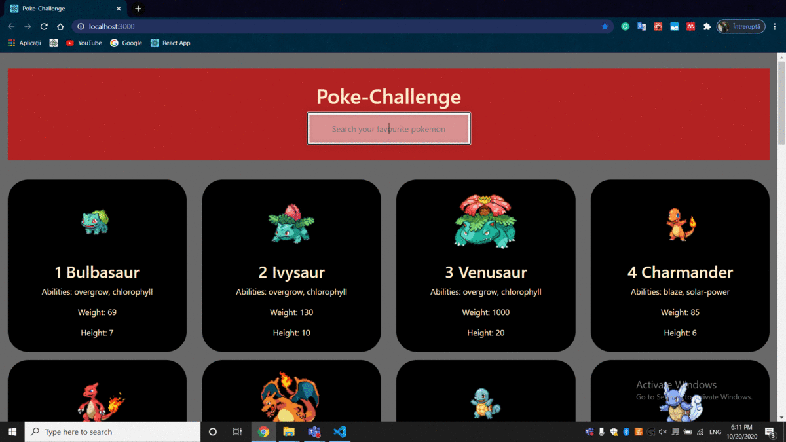

# Poke-Challenge
# Frotend App built with ReactJS
The project uses ReduxJS for state management and includes actions and reducers for the search bar, actions and reducers for fetching pokemons' data ( Redux-Thunk ) and the store.
Data about pokemons comes from PokeApi.
The app displays the pokemon cards under a search field, which filters the pokemons by name according to user's input.

## The main tehnologies used for creating the app:
* React.js
* Redux.js
* Redux-Thunk
* Bootstrap

## To run the project locally
1. git clone https://github.com/Claudiu98n/poke-challenge.git
2. cd poke-challenge
3. npm install
4. npm start

### Demo

